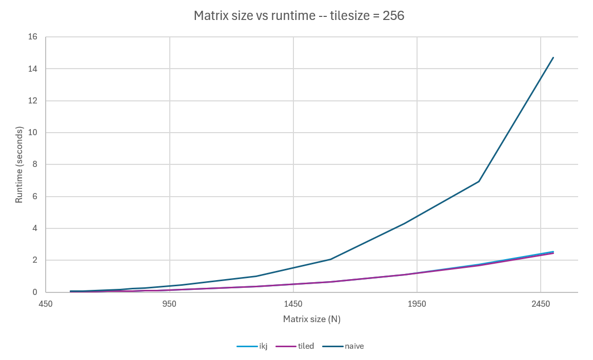
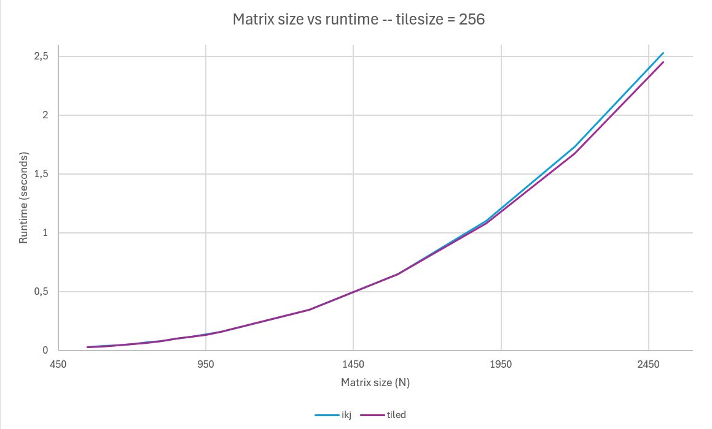
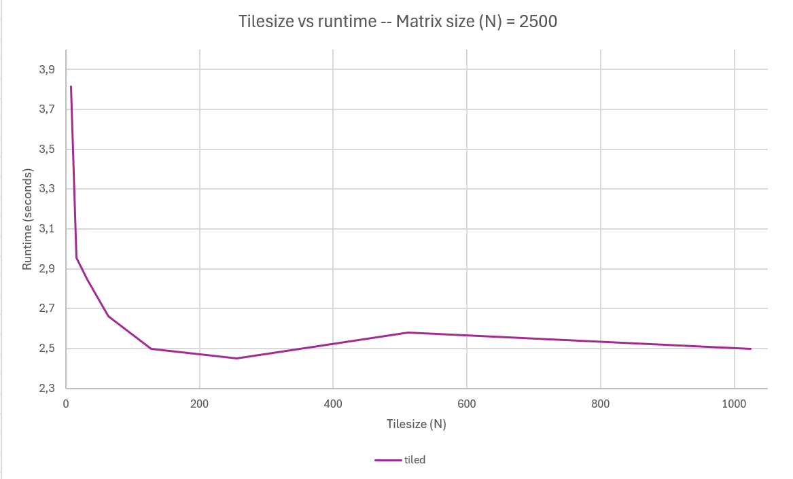

# Matrix multiplication preformance in C++
This project explores how different implementations of matrix multiplication
in C++ have a very different preformance despite preforming the same calculations. 

The goal is to understand how memory access patterns, cache locality and loop ordering
affect execution time on a modern CPU

The project compares three different implementations of matrix multiplication:
- Naive i-j-k multiplication
- Reordered i-k-j multiplication
- Tiled matrix multiplication

## Matrix layout
All matrices are stored as std::vectors.
For example a 3x3 matrix A:

```text
[ 1  2  3 ]
[ 4  5  6 ]
[ 7  8  9 ]
```

is stored as:

```text
[ 1  2  3 | 4  5  6 | 7  8  9 ]
  row 0     row 1     row 2

```
For an `NxN` matrix `A`, `A[row][column]` becomes `A[N*row + column]`.

## Naive i-j-k multiplication
This is the most straightforward way of multiplying two matrices (exactly like you'd do on paper).

For two `3×3` matrices `a` and `b`, with `output = a × b`:
`output[row, column] = a[row, 0] * b[0, column] + a[row, 1] * b[1, column] + a[row, 2] * b[2, column]`
Here, `k` loops from `0` to `2` while `row` and `column` stay constant.

By letting `row` and `column` loop over every valid value, the full output matrix is produced.


## Reordered i-k-j multiplication
This algorithm keeps the row and k constant in the inner loop while letting the column vary.

For 2 3x3 matrices a,b and output = a x b:
Now we contribute to three different output elements in the inner loop.
`output[row,0] += a[row,k]**b[k,0], output[row,1] += a[row,k]**b[k,1] and output[row,2] += a[row,k]*b[k,2]`

The performance of this algorithm is better than the naive algorithm because as you can see it accesses memory stored next to eachother in the array like `b[k*N]->b[k*N + 1]->b[k*N +2]`. These elements are already in cache while accessed because these elements are likely stored in the same cache block. 

In the naive algorithm the order is `b[column]->b[N + column]->b[2*N + column]` which are not stored next to eachother in memory.


## Tiled matrix multiplication
The tiled implementation divides a matrix (N x N) in a number of tiles (tilesize x tilesize). 
This way it repeatedly uses small working sets of matrix a, b and output, while those values are likely in the cache.


For this example we have a 4x4 matrix that we split in tiles of 2x2. 
```text
a =                         b =                         output = a × b

[ 1  2 | 3  4 ]           [ 1  0 | 2  1 ]           [ 11 13 | 12  8 ]
[ 5  6 | 7  8 ]      ×    [ 0  1 | 3  2 ]      =    [ 27 29 | 36 24 ]
[------+------]           [------+------]           [-------+-------]
[ 2  0 | 1  3 ]           [ 2  1 | 0  1 ]           [  7  7 |  7  3 ]
[ 1  1 | 0  2 ]           [ 1  2 | 1  0 ]           [  3  5 |  7  3 ]
```

Instead of calculating the whole output matrix at once, the algorithm focuses on one small tile of the output.
A single tile of the output is produced by multiple tiles that all contribute via the shared dimention k.
For example if row = 1, column = 2 and k = 0: we contribute to output[1][2] by adding a[1][0]*b[0][2] to it.

Inside each tile the algorithm still uses the cache friendly i-k-j (row-k-column) loop order. 

If the size of the matrix N is not divisible by the tilesize, the matrix is divided as follows:
```text
A (4x4 matrix divided by 3x3 tiles)

[ 1  2  3 | 4 ]      
[ 5  6  7 | 8 ]             
[ 2  0  1 | 3 ] 
[---------+---]          
[ 1  1  0 | 2 ]           
```

## Benchmarking methodology
The multiplication is done on an AMD Ryzen AI 9 365 w/ Radeon 880M and 32GB RAM and code is compiled by GCC compiler at optimization level -O3. 

The matrix sizes go from N=100 all the way up to N = 2500 and for fixed matrix sizes the tilesize is also changed for the tiled multiplication (8-16-32-64-128 - ... - N/2). 

The benchmark is done 10 times for each matrixsize and the median runtime is used to reduce the influence of scheduling noise and outliers.

To measure the runtime, std::chrono::steady_clock is used. Only the matrix multiplication is timed and all timings are measured in microseconds. 

The result of the multiplication is used after timing so the multiplication could not be optimized away by the compiler.

The tested matrices are randomly generated using `<random>` and for a given matrix size N, the matrices tested for the different methods are all the same. 

## Results
### Overall performance

The naive algorithm scales at roughly N**3.
It's very clear that the naive algorithm is a lot slower for larger matrices coming in at 14,7 seconds for a 2500x2500 matrix.
Followed by ikj at 2,53 seconds and tiled at 2,45 seconds.

### ikj vs tiled

The tiled and ikj algorithms are very close because ikj already accesses matrix b and the output-matrix sequentially which is a huge win. For small matrix sizes where the tilesize is almost as big as the matrixsize, the performance of tiled is the same as ikj because they are essentially almost exactly the same at these size to tilesize ratio's.

It's only for matrix sizes bigger than 2000 that there's a difference between the two because as N grows the working set increasingly exceeds cache capacity and that's when the extra temporal locality from tiling starts to matter.

It's expected that for even larger matrices the difference will be bigger but because of timing constraints I couldn't run matrices larger than 2500x2500.


### Tilesize comparison

For tilesizes lower than 100, the tiled algorithm is actually slower than the ikj-algorithm because overhead losses exceed tiled gains. 
The overhead is primarily caused by:
- boundary checks
- more loop levels
- smaller inner-loops
